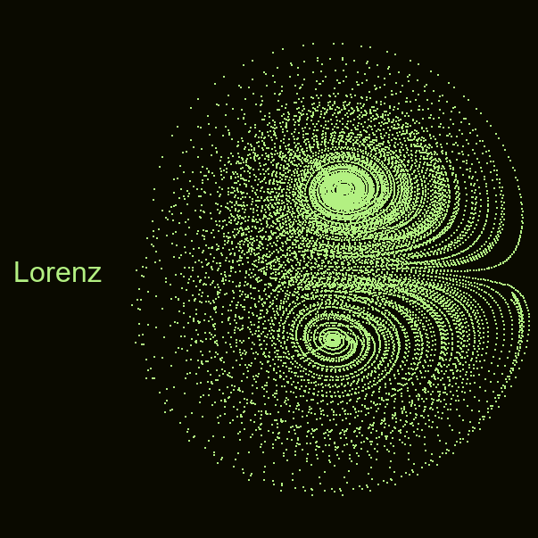

<div align="center">




# Strange Attractors Visualizer
---
</div> 

## Contents
* [About](#about)
* [Specifications](#specifications)
* [Usages](#usages)
* [Notes](#notes)
* [References](#references)
---

<a name="about"></a>
## About
Strange Attractors Visualizer - Chaos Theory’s Strange Attractor Illustration	
- Created a dynamic visualizer in Python capable of rendering up to 11 distinct strange attractors.
- Simplified curve generation by evaluating and subsampling attractor functions, allowing visualization of complex systems.
- Investigated up to 5 decimal places of local initialization coordinates for consistent convergent trajectories. 
---

<a name="specifications"></a>
## Specifications
Strange attractors included are listed below.  
| Attractors | Parameters | Equations | 
| --- | --- | --- |
| Lorenz | $\sigma = 10, \rho = 28, \beta = \frac{8}{3}$ | $\frac{dx}{dt} = \sigma(-x + y),\frac{dy}{dt} = -xz + \rho x - y,\frac{dz}{dt} = xy - \beta z$ | 
| Thomas | $a = 0.95, b = 0.7, c = 0.6, d = 3.5, e = 0.25, f = 0.1$ | $\frac{{dx}}{{dt}} = \sin(y) - b \cdot x,\frac{{dy}}{{dt}} = \sin(z) - b \cdot y,\frac{{dz}}{{dt}} = \sin(x) - b \cdot z\ $ |
| Aizawa | $b = 0.208186$ | $\frac{{dx}}{{dt}} = (z - b) x - dy,\frac{{dy}}{{dt}} = dx + (z - b) y,\frac{{dz}}{{dt}} = c + az - \frac{{z^3}}{{3}} - (x^2 + y^2)(1 + ez) + fzx^3$ |
| Dadras | $a = 3, b = 2.7, c = 1.7, d = 2, e = 9$ | $\frac{{dx}}{{dt}} = y-ax+byz,\frac{{dy}}{{dt}} = cy-xz+z,\frac{{dz}}{{dt}} = dxy-ez$ |
| Chen | $\alpha = 5, \beta = -10, \delta=-0.38$ | $\frac{{dx}}{{dt}} = \alpha x-yz,\frac{{dy}}{{dt}} = \beta y +xz,\frac{{dz}}{{dt}} = \delta z + \frac{xy}{3}$ |
| Rossler | $a=0.95, b=7.91,f=4.83,g=4.66$ | $\frac{{dx}}{{dt}} = \alpha x-yz,\frac{{dy}}{{dt}} = \beta y +xz,\frac{{dz}}{{dt}} = \delta z + \frac{xy}{3}$ |
| Halvorsen | $a=0.2, b=0.2, c=5.7$ | $\frac{{dx}}{{dt}} = -(y+z),\frac{{dy}}{{dt}} = x+ay,\frac{{dz}}{{dt}} = b+z(x-c)$ |
| Rabinovich Fabrikant | $\alpha = 0.14,\gamma=0.10$ | $\frac{{dx}}{{dt}} = y(z-1+x^2)+\gamma x,\frac{{dy}}{{dt}} = x(3z+1-x^2)+\gamma y,\frac{{dz}}{{dt}} = -2z(\alpha + xy)$ |
| Three-Scroll Unifed | $a=32.48,b=45.84,c=1.18,d=0.13,e=0.57,f=14.7$ | $\frac{{dx}}{{dt}} = a(y-x)+dxz,\frac{{dy}}{{dt}} = bx-xz+fy,\frac{{dz}}{{dt}} = cz+xy-ex^2$ |
| Sprott | $a=2.07,b=1.79$ | $\frac{{dx}}{{dt}} = y+axy+xz,\frac{{dy}}{{dt}} = 1-bx^2+yz,\frac{{dz}}{{dt}} = x-x^2-y^2$ |
| Four-Wing | $a=0.2, b=0.01, c=-0.4$ | $\frac{{dx}}{{dt}} = ax+yz,\frac{{dy}}{{dt}} = bx+cy-xz,\frac{{dz}}{{dt}} = -z-xy$ |
---

<a name="usages"></a>
## Usages
- ```A```/```D```: Change attractor.
- ```Esc```: Exit.
---

<a name="notes"></a>
## Notes
- Preset parameters and inital coordinates are tweaked to be stable.
- These can be tweaked in attractors.py but might cause coordinates to overflow integer limit.
- <ins>Add</ins>: z scaling so the closer the particles the bigger it is.
---

<a name="references"></a>
## References
- Attractors by [Wikipedia](https://en.wikipedia.org/wiki/Attractor).  
- Attractors' Equations by [3D-Meier](http://www.3d-meier.de/tut19/Seite0.html).